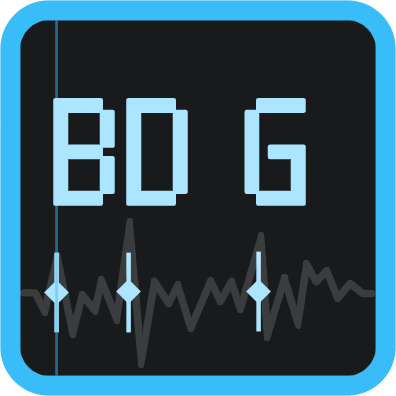
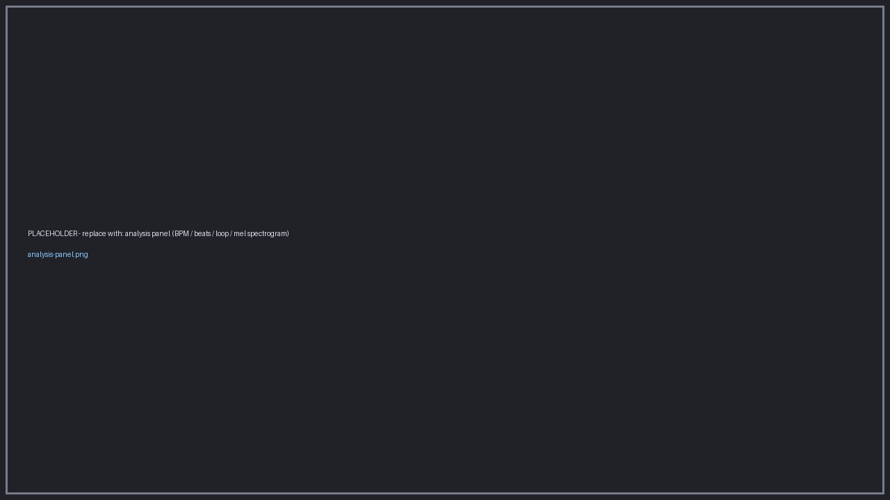
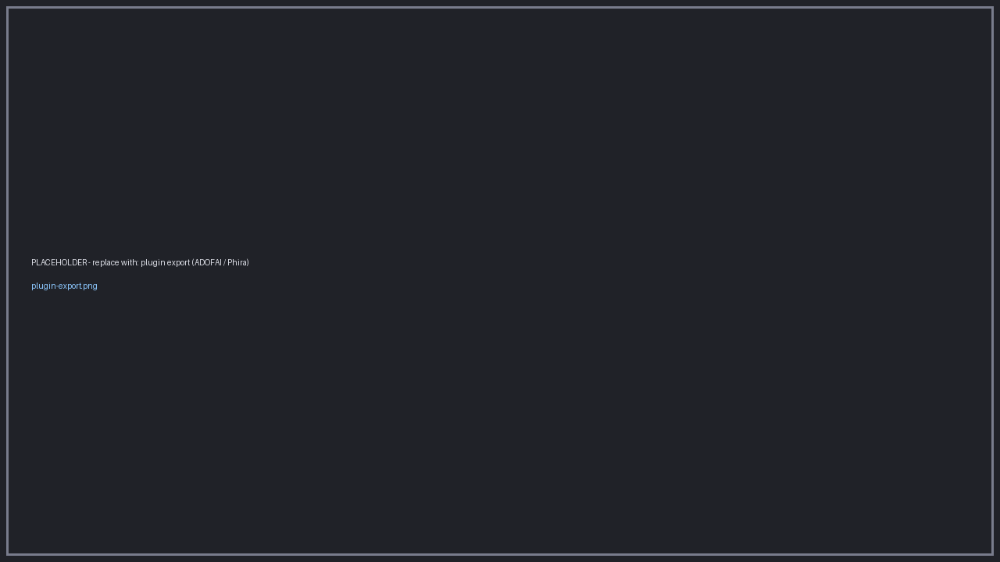
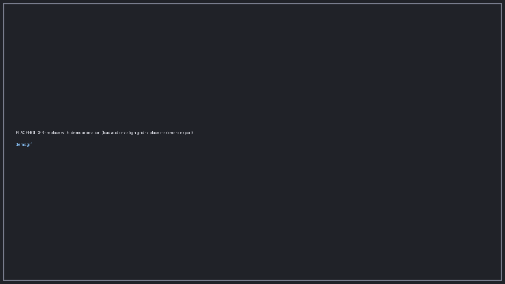

#  Beat Data Generator

[English](README_EN.md) | **中文**

音乐节拍踩点编辑器：在波形图上对齐歌曲节拍轴，放置踩点（beat marker）与 BPM 变速点，为节奏类应用生成节拍数据。**一次踩点，可导出到多个目标软件**（见[导出与对接目标](#导出与对接目标)）。

[](LICENSE)
[](https://github.com/BUGJI/beat_data_generator/releases/latest)


## 下载与安装

| 平台 | 安装方式 | 状态 |
| --- | --- | --- |
| **Windows**（x64） | 到 [Releases](https://github.com/BUGJI/beat_data_generator/releases/latest) 下载 `Beat-Data-Generator-<版本>-setup.exe` 运行安装 | ✅ 可用 |
| **macOS / Linux** | 暂无预编译包，可参考[开发](#开发)从源码运行 | 🚧 适配中 |

当前发布为**公测版**。macOS / Linux 的支持已在计划内，欢迎在这两个平台上试用源码版本并反馈问题。

**自动更新**：应用启动时会静默检查新版本（可在 **设置 → 高级 → 窗口与启动** 关闭），也可在 **设置 → 关于 → 检查更新** 手动检查；新版本从 GitHub Releases 获取。

<!-- 待补充：若安装包未签名，建议在此说明 Windows SmartScreen 的提示与处理方式 -->

## 功能特性

### 编辑

- **音频加载**：支持 mp3 / wav / ogg / flac / m4a / aac / opus，实时绘制波形图。
- **节拍网格**：双轴（时间轴 + 节拍轴），以拍为单位吸附放置（1 ~ 1/32 拍细分）。
- **踩点编辑**：点击添加、拖动微调、右键删除；支持按吸附步进微调、多选（Ctrl/Cmd + 点击）、全选。
- **多踩点轨道**：轨道可增删、重命名、换色、锁定与隐藏；隐藏轨道的踩点不计入播放指示灯与导出。
- **循环组**：单个主踩点可按“间隔拍数 × 个数”批量生成子点，并可排除指定项；单个循环组最多生成 **256** 个子点以防编辑器卡死。
- **便签**：在时间线上放置浮动便签（非模态、不抢焦点），双击编辑（Markdown）。
- **撤销 / 重做**：最多 100 步历史；支持复制 / 粘贴踩点组（含循环）。

### 分析与播放

- **音频智能分析**：载入音频后自动检测 BPM、节拍打点、找出最佳循环段落，并在播放中实时刷新 BPM、渲染梅尔频谱到可折叠的分析面板。基于 **pleco-xa**，重计算均在 Web Worker 中异步进行，每项能力可独立开关（见设置）。
- **BPM 速度轨**：可放置 BPM 点（绝对 BPM 或倍数两种模式）构建变速（tempo map）；支持锁定 BPM。
- **变速播放**：0.1–4 倍速播放；可选“变调跟随”，或保持音高的“保调变速”（默认 `signalsmith-stretch`，可回退到 `soundtouchjs`，见[变速引擎](#变速引擎)）。
- **打拍音**：播放经过踩点时发出打拍音，可选用自定义音频文件（默认留空则不播放）。
- **自动跟随**：播放时播放头越过阈值自动滚动跟随时间线。

### 工程与导出

- **工程文件**：`.bdg`（JSON）保存，音频以相对路径记录并附带 MD5，重新打开时自动校验、自动重链。
- **自动保存**：可配置间隔（1–60 分钟）后台自动保存当前工程。
- **内置导出**：时间戳列表 `.txt`（毫秒精度去重）与 **CMX3600 EDL** `.edl`（25 fps non-drop）。
- **插件化导入 / 导出**：ADOFAI、Phira、MIDI 等目标由官方插件提供，见下表。

### 扩展与外观

- **插件系统**：可扩展新的导入 / 导出格式、侧栏浮动面板、自定义快捷键、独立预览窗口与类型化轨道；详情见 [`docs/plugin-system.md`](docs/plugin-system.md)。
- **主题系统**：6 套预设（default / midnight / forest / amber / graphite / light），并支持按 token 自定义配色，实时生效。
- **其他**：多语言界面（中文 / English）、欢迎页与最近工程、记住窗口位置、退出模式设置。

## 导出与对接目标

同一份踩点工程可以导出或对接多个目标：通用格式由编辑器内置提供，其余通过[官方插件组织](https://github.com/beat-data-generator)分发。

| 目标 | 形式 | 提供方 |
| --- | --- | --- |
| 时间戳列表 | `.txt`：每行一个浮点毫秒时间戳（3 位小数），跨轨道同刻去重 | 内置 |
| CMX3600 EDL | `.edl`：25 fps、Non-Drop Frame，每个踩点生成一个 1 帧事件并带 `FROM CLIP NAME` | 内置 |
| A Dance of Fire and Ice | `.adofai` 关卡，支持双押、BPM 变速轨道与暂停补偿 | 插件 [bdg_plugin_adofai](https://github.com/beat-data-generator/bdg_plugin_adofai) |
| Phira / RPE | `.pez` 谱面，可选合并成单判定线模式，并连同音频一起打包 | 插件 [bdg_plugin_phira](https://github.com/beat-data-generator/bdg_plugin_phira) |
| DG-LAB 4 | 通过 WebSocket Relay 连接设备，播放到踩点时联动输出强度 / 脉冲（实时联动，非文件导出） | 插件 [bdg_plugin_dglab_v3](https://github.com/beat-data-generator/bdg_plugin_dglab_v3) |
| 文本时间戳 / MIDI（导入） | 从文本时间戳或 MIDI 导入踩点：整数按毫秒、含小数按秒；MIDI 按音符时间新建轨道 | 插件 [bdg_plugin_import](https://github.com/beat-data-generator/bdg_plugin_import) |

**安装插件**：下载插件仓库文件夹 → 放入插件目录（**设置 → 插件 → 打开插件目录**，即 `<userData>/plugins`）→ 在设置里点“重新扫描并加载”。开发模式下也会扫描项目根目录的 `plugins/`。

**想自己做插件**：[`plugins/plugin-api.d.ts`](plugins/plugin-api.d.ts) 提供带注释的类型声明，[bdg_plugin_template](https://github.com/beat-data-generator/bdg_plugin_template) 是最小可运行模板，详见 [`docs/plugin-system.md`](docs/plugin-system.md)。

## 界面







## 使用入门

1. 启动后从“文件”菜单 **打开音频**，波形将载入时间线。
2. 在 **BPM 轨** 点击放置 BPM 点（或直接在侧栏调整基础 BPM 与偏移）来对齐节拍网格。
3. 在 **踩点轨** 上点击添加踩点（自动吸附），拖动微调位置。
4. 播放验证踩点位置，可开/关自动跟随；需要时用变速 / 保调变速试听。
5. **保存工程**（`.bdg`）以保留踩点与 BPM 数据。
6. 用内置导出（时间戳 / EDL）或已安装的插件导出到目标格式。

## 键盘快捷键

| 按键 | 功能 |
| --- | --- |
| 空格 | 播放 / 暂停 |
| Ctrl+S | 保存工程 |
| Ctrl+C / Ctrl+V | 复制 / 粘贴踩点组 |
| Ctrl+Z / Ctrl+Shift+Z | 撤销 / 重做 |
| Delete | 删除选中对象 |
| ← / → | 按吸附步进左右微调（选中时） |
| Esc | 关闭浮动卡 / 取消选择 |
| Home | 回到起点 |
| Ctrl+滚轮 | 缩放时间线（悬停时间线上时） |
| 滚轮 / 拖拽 | 上下 / 左右滚动时间线 |

快捷键目前为只读展示（可在 **设置 → 快捷键** 查看），自定义改键将在后续版本提供；插件可通过 `api.ui.registerShortcut` 注册自己的快捷键。

## 技术栈

| 层 | 技术 |
| --- | --- |
| 桌面框架 | Electron |
| 构建工具 | electron-vite / Vite 7 |
| 前端 | Vue 3 + TypeScript |
| 状态管理 | Pinia |
| 数据校验 | zod 4（工程文件 / 设置 schema） |
| 组件库 | reka-ui（无头组件）+ Tailwind CSS v4 |
| 图标 | @lucide/vue |
| 国际化 | vue-i18n |
| 音频变速 | signalsmith-stretch（默认）/ soundtouchjs（回退） |
| 音频智能分析 | pleco-xa（Web Worker 异步） |
| Markdown 渲染 | slimdown-js（便签 / 插件面板） |
| 波形绘制 | Canvas（自绘） |
| 自动更新 | electron-updater（GitHub Releases） |
| 日志 | electron-log |

## 项目结构

```
src/
├── main/            # Electron 主进程：窗口管理、IPC、文件对话框、设置/最近工程持久化、插件管理
├── preload/         # 预加载脚本（contextBridge 暴露安全 API）
├── shared/          # 主/渲染进程共享的 IPC 类型、设置 schema 与插件契约
└── renderer/        # Vue 渲染进程
    └── src/
        ├── components/   # TopBar / SideBar / TransportBar / Timeline / SettingsModal / ProjectBar / AnalysisPanel 等
        ├── stores/       # Pinia stores：project / selection / transport / view / settings / ui
        ├── services/     # 业务编排：timeline / history / clipboard / playback / audioIO / projectIO / bootstrap
        ├── schemas/      # zod 工程文件 schema（v1 → v2 迁移与逐项容错）
        ├── plugins/      # 插件宿主：注册表 / 事件 / 桥接 API
        ├── i18n/         # 中英文案（zh / en）
        ├── engine.ts     # Web Audio 播放引擎
        ├── tempo.ts      # 节拍 ↔ 时间换算与 tempo map
        ├── stretch.ts    # soundtouchjs 时间拉伸
        ├── analysis.ts   # 音频智能分析桥接（pleco-xa，Web Worker 异步）
        ├── analysis.worker.ts # 分析 Worker（BPM / 节拍 / 循环 / 频谱）
        ├── theme.ts      # 主题预设与配色 token 派生
        └── metrics.ts    # 绘制度量与配色
```

> 注：`src/renderer/src/store/index.ts` 只是兼容旧引用的 re-export 桶文件，实际状态在 `stores/`、编排在 `services/`。

## 开发

要求 **Node.js ≥ 20.19**（Vite 7 的最低要求）与 npm。

```bash
# 安装依赖
npm install

# 开发模式（热重载）
npm run dev

# 预览打包产物
npm start

# 构建（输出到 out/）
npm run build

# 打包 Windows 安装包（输出到 release/）
npm run dist:win

# 类型检查（主进程 + 渲染进程）
npm run typecheck

# 运行测试（vitest）
npm test

# 测试（监听模式）
npm run test:watch

# 测试覆盖率
npm run test:cov

# 代码检查与格式化
npm run lint
npm run lint:fix
npm run format
npm run format:check
```

测试目前覆盖纯逻辑层：节拍换算（`tempo.ts`）、工程文件解析与容错（`schemas/project.ts`）、设置修复（`shared/settings.ts`），以及撤销/重做与导出格式（`services/history.ts` / `services/projectIO.ts`）。

### 运行日志

运行日志（electron-log）默认只输出到终端；如需落盘，在 **设置 → 开发者选项** 打开“记录运行日志到文件”（默认关闭）。开启后写入 `<userData>/logs/main.log`（超过 5 MB 自动轮转），主进程日志与渲染进程的 console 警告 / 错误都会汇集到此文件（Windows 通常为 `%APPDATA%\<应用名>\logs\main.log`），便于排查打包后没有 DevTools 的场景。

### 变速引擎

变速播放（保持音高）默认使用 `signalsmith-stretch`（WASM 离线渲染，音质更好）；可在 **设置 → 音频 → 播放** 切回 `soundtouchjs`。Signalsmith 渲染失败或超时会自动回退到 SoundTouch。

## 常见问题

- **日志在哪？** 见[运行日志](#运行日志)：默认不落盘，需在开发者选项里手动开启。
- **保调变速音质 / 卡顿？** 默认走 `signalsmith-stretch`；渲染失败或超时会自动回退 `soundtouchjs`，也可在 **设置 → 音频 → 播放** 固定引擎。
- **点“检查更新”没反应？** 开发模式下不支持检查更新；检查失败时可直接到 [Releases](https://github.com/BUGJI/beat_data_generator/releases/latest) 手动下载。
- **macOS / Linux 能用吗？** 目前只在 Windows 上发布安装包；其他平台的适配在计划中，欢迎先在源码模式下试用并反馈。
- **EDL 为什么只有 25 fps？** 当前固定 25 fps Non-Drop Frame；需要其他帧率或导出格式，欢迎到 [Issues](https://github.com/BUGJI/beat_data_generator/issues) 提需求，或参考[导出与对接目标](#导出与对接目标)用插件自行实现。

## 许可

本项目以 **GNU GPL v3** 协议发布（详见 [`LICENSE`](LICENSE)）。作者：**BUGJI**。

第三方依赖（signalsmith-stretch、soundtouchjs、pleco-xa、Electron 等）遵循各自的许可协议；内置打拍音素材位于 `resources/metronomes/`。
