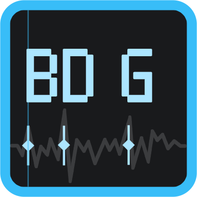

#  Beat Data Generator

[English](README_EN.md) | [中文](README.md) | **한국어**

음악 비트 마커 편집기: 오디오 파형 위에 비트 그리드를 정렬하고, 비트 마커와 BPM 변경 포인트를 배치해 리듬 기반 애플리케이션용 비트 데이터를 생성해요. **한 번 찍으면 여러 대상으로 내보낼 수 있어요** ([내보내기 및 연동 대상](#내보내기-및-연동-대상) 참고).

[](LICENSE)
[](https://github.com/BUGJI/beat_data_generator/releases/latest)
[](https://github.com/BUGJI/beat_data_generator/actions/workflows/ci.yml)


## 다운로드 및 설치

| 플랫폼 | 설치 방법 | 상태 |
| --- | --- | --- |
| **Windows** (x64) | [Releases](https://github.com/BUGJI/beat_data_generator/releases/latest)에서 `Beat-Data-Generator-<버전>-setup.exe`를 내려받아 실행하세요 | ✅ 사용 가능 |
| **Linux** (x64) | [Releases](https://github.com/BUGJI/beat_data_generator/releases/latest)에서 `Beat-Data-Generator-<버전>.AppImage` 또는 `beat-data-generator_<버전>_amd64.deb`를 내려받으세요 | ✅ 사용 가능 |
| **macOS** | 아직 사전 빌드 패키지가 없어요 — [개발](#개발)을 참고해 소스에서 실행하세요 | 🚧 준비 중 |

현재 릴리스는 **공개 베타**예요. Linux는 0.3.5부터 AppImage와 deb 설치 패키지를 제공하며, macOS 지원은 로드맵에 있어요 — 소스 빌드를 사용해 보시고 피드백을 주시면 감사하겠어요.

**자동 업데이트**: 앱은 시작할 때 새 버전을 조용히 확인해요 (**설정 → 일반 → 창 및 시작**에서 끌 수 있어요). **설정 → 정보 → 업데이트 확인**에서 직접 확인할 수도 있어요. 새 버전은 GitHub Releases에서 받아요. Linux에서는 AppImage만 앱 내 자동 업데이트를 지원하며, deb 설치는 시스템 패키지 관리자로 업그레이드하세요.

버전별 변경 내역은 [`CHANGELOG.md`](CHANGELOG.md)(중국어)를 참고하세요.

## 기능

### 편집

- **오디오 가져오기**: mp3 / wav / ogg / flac / m4a / aac / opus 지원, 실시간 파형 렌더링.
- **비트 그리드**: 이중 눈금(시간 + 박자). 1 ~ 1/32 박자 세분으로 스냅해요.
- **마커 편집**: 클릭해 추가, 끌어 미세 조정, 오른쪽 클릭해 삭제; 스냅 단위 미세 이동, 다중 선택(Ctrl/Cmd + 클릭), 전체 선택.
- **여러 마커 트랙**: 트랙 추가 / 이름 변경 / 색상 변경 / 잠금 / 숨기기. 숨긴 트랙의 마커는 재생 표시와 내보내기에서 제외돼요.
- **루프 그룹**: 메인 마커에서 `간격 × 개수`로 하위 마커를 생성하고 일부를 제외할 수 있어요; 그룹당 **256**개로 제한해 편집기 반응성을 유지해요.
- **스티커 메모**: 타임라인에 떠 있는 메모(비모달, 포커스를 뺏지 않음)를 놓고 두 번 클릭해 Markdown으로 편집해요.
- **실행 취소 / 다시 실행**: 최대 100단계; 마커 그룹(루프 포함) 복사 / 붙여넣기.

### 분석 및 재생

- **오디오 인텔리전스**: 로드 시 BPM 자동 감지, 비트 마커 배치, 최적 루프 구간 탐색을 수행하고, 재생 중 실시간 BPM 판독과 멜 스펙트로그램을 접이식 분석 패널에 표시해요. **pleco-xa** 기반이며 Web Worker에서 비동기로 계산하고, 각 기능은 설정에서 독립적으로 켜고 끌 수 있어요.
- **BPM 레인**: BPM 포인트(절대 BPM 또는 배수 모드)를 추가해 템포 맵을 만들 수 있어요; BPM 잠금을 지원해요.
- **가변 속도 재생**: 0.1–4× 속도; 음높이를 따라가는 재생 또는 음높이를 유지하는 타임 스트레치(기본 `signalsmith-stretch`, 대체 `soundtouchjs` — [타임 스트레치 엔진](#타임-스트레치-엔진) 참고).
- **메트로놈 클릭**: 마커를 지날 때마다 소리가 나요; 사용자 오디오 파일을 선택할 수 있어요(비워 두면 비활성).
- **자동 따라가기**: 재생 헤드가 설정한 임계값을 지나면 타임라인이 스크롤돼요.

### 프로젝트 및 내보내기

- **프로젝트 파일**: `.bdg`(JSON). 오디오는 프로젝트 기준 상대 경로와 MD5로 기록되며, 열 때 검증하고 자동으로 다시 연결해요.
- **자동 저장**: 설정한 간격(1–60분)으로 백그라운드에서 현재 프로젝트를 저장해요.
- **내장 내보내기**: 타임스탬프 목록 `.txt`(밀리초 정밀도, 중복 제거) 및 **CMX3600 EDL** `.edl`(25 fps, non-drop).
- **플러그인 기반 가져오기 / 내보내기**: ADOFAI, Phira, MIDI 등은 공식 플러그인이 제공해요 — 아래 표를 참고하세요.

### 확장 및 외형

- **플러그인 시스템**: 새 가져오기/내보내기 형식, 떠 있는 사이드바 패널, 사용자 지정 단축키, 독립 미리보기 창, 타입 지정 트랙으로 확장할 수 있어요. 자세한 내용은 [`docs/plugin-system.md`](docs/plugin-system.md).
- **플러그인 마켓플레이스**: 탐색, 검색, 분류 필터 후 공식 플러그인을 원클릭으로 설치 / 업데이트 / 삭제하거나 로컬 ZIP으로 오프라인 설치할 수 있어요. 설치 전 SHA-256 검증과 신뢰 확인을 거쳐요 ([플러그인 설치](#내보내기-및-연동-대상) 참고).
- **테마**: 6개 프리셋(default / midnight / forest / amber / graphite / light), 토큰별 색상 사용자 지정과 독립 강조색, 실시간 적용.
- **외형**: 로컬 이미지를 앱 배경으로 사용(채우기 / 맞추기 / 타일, 흐림과 어둡게 포함)하고 UI 배율, 글꼴 배율, 모서리 반경, 그림자, 패널 불투명도를 조절할 수 있어요.
- **간단 모드**: 기본으로 켜져 있어 고급 옵션과 "고급" 분류를 숨겨요; **설정 → 일반**에서 끌 수 있어요.
- **네트워크**: 프록시 소스(시스템 / 환경 변수 / 사용 안 함)를 고르고 GitHub 미러를 켜서 마켓과 업데이트에 접근할 수 있어요.
- **기타**: 다국어 UI(中文 / English / 한국어), 최근 프로젝트가 있는 환영 화면, 창 상태 기억, 닫기 모드 설정.

## 내보내기 및 연동 대상

하나의 프로젝트를 여러 대상으로 내보낼 수 있어요. 범용 형식은 편집기에 내장되어 있고, 나머지는 [공식 플러그인 조직](https://github.com/beat-data-generator)을 통해 배포돼요.

| 대상 | 형식 | 제공 |
| --- | --- | --- |
| 타임스탬프 목록 | `.txt`: 한 줄에 하나의 실수 밀리초 타임스탬프(소수 3자리), 트랙 간 동시각 중복 제거 | 내장 |
| CMX3600 EDL | `.edl`: 25 fps, Non-Drop Frame; 각 마커가 `FROM CLIP NAME`이 있는 1프레임 이벤트 생성 | 내장 |
| A Dance of Fire and Ice | `.adofai` 레벨, 동시 입력, BPM 속도 트랙, 일시정지 보정 지원 | 플러그인 [bdg_plugin_adofai](https://github.com/beat-data-generator/bdg_plugin_adofai) |
| Phira / RPE | `.pez` 채보, 선택적 단일 판정선 병합, 오디오와 함께 패키징 | 플러그인 [bdg_plugin_phira](https://github.com/beat-data-generator/bdg_plugin_phira) |
| 텍스트 타임스탬프 / MIDI (가져오기) | 텍스트 타임스탬프 또는 MIDI에서 마커 가져오기: 정수는 밀리초, 소수는 초; MIDI 노트 시각으로 새 트랙 생성 | 플러그인 [bdg_plugin_import](https://github.com/beat-data-generator/bdg_plugin_import) |

**플러그인 설치**: **설정 → 플러그인 → 마켓플레이스**에서 공식 플러그인을 원클릭으로 설치할 수 있어요. 또는 플러그인 저장소 폴더를 내려받아 → 플러그인 디렉터리(**설정 → 플러그인 → 플러그인 폴더 열기**, 즉 `<userData>/plugins`)에 넣고 → 설정에서 "다시 검색 및 로드"를 누르세요. 개발 모드에서는 프로젝트의 `plugins/` 폴더도 검색해요.

**직접 플러그인 만들기**: [`plugins/plugin-api.d.ts`](plugins/plugin-api.d.ts)에 주석이 달린 타입 선언이 있고, [bdg_plugin_template](https://github.com/beat-data-generator/bdg_plugin_template)은 최소 실행 템플릿이며, 전체 가이드는 [`docs/plugin-system.md`](docs/plugin-system.md)에 있어요.

## 스크린샷


## 빠른 시작

1. 앱을 실행하고 파일 메뉴에서 **오디오 열기**를 선택하면 파형이 타임라인에 로드돼요.
2. **BPM 레인**을 클릭해 템포 포인트를 추가하거나, 사이드바에서 기본 BPM / 오프셋을 조정해 비트 그리드를 정렬하세요.
3. **마커 트랙**을 클릭해 마커를 놓고(자동 스냅), 끌어서 미세 조정하세요.
4. 재생하며 마커를 확인하고, 자동 따라가기를 켜고 끄거나 다른 속도와 음높이 유지 스트레치로 들어 보세요.
5. **프로젝트 저장**(`.bdg`)으로 마커와 BPM 데이터를 보관하세요.
6. 내장 내보내기(타임스탬프 / EDL) 또는 설치한 플러그인으로 내보내세요.

## 키보드 단축키

| 키 | 동작 |
| --- | --- |
| Space | 재생 / 일시정지 |
| Ctrl+S | 프로젝트 저장 |
| Ctrl+C / Ctrl+V | 마커 그룹 복사 / 붙여넣기 |
| Ctrl+Z / Ctrl+Y / Ctrl+Shift+Z | 실행 취소 / 다시 실행 |
| Delete / Backspace | 선택 항목 삭제 |
| ← / → | 스냅 단위로 좌우 미세 이동(선택 시) |
| Esc | 팝오버 닫기 / 선택 해제 |
| Home | 처음으로 이동 |
| Ctrl+휠 | 타임라인 확대/축소(타임라인 위에 있을 때) |
| 휠 / 드래그 | 타임라인 세로 / 가로 스크롤 |

단축키는 현재 읽기 전용이며(**설정 → 단축키**에서 확인), 사용자 지정 변경은 추후 버전에서 제공될 예정이에요. 플러그인은 `api.ui.registerShortcut`으로 자체 단축키를 등록할 수 있어요.

## 기술 스택

| 계층 | 기술 |
| --- | --- |
| 데스크톱 셸 | Electron |
| 빌드 도구 | electron-vite / Vite 7 |
| 프런트엔드 | Vue 3 + TypeScript |
| 상태 관리 | Pinia |
| 데이터 검증 | zod 4(프로젝트 파일 / 설정 스키마) |
| UI | reka-ui(헤드리스) + Tailwind CSS v4 |
| 아이콘 | @lucide/vue |
| 국제화 | vue-i18n |
| 타임 스트레치 | signalsmith-stretch(기본) / soundtouchjs(대체) |
| 오디오 인텔리전스 | pleco-xa(Web Worker 비동기) |
| Markdown 렌더링 | slimdown-js(메모 / 플러그인 패널) |
| 파형 | Canvas(자체 구현) |
| 자동 업데이트 | electron-updater(GitHub Releases) |
| 플러그인 압축 해제 | fflate(ZIP) |
| 로깅 | electron-log |

## 프로젝트 구조

```
src/
├── main/            # Electron 메인: 진입점은 수명 주기만 담당; settings / recents / lastDirs / windowState / metronome / files / windows / ipc / ipcHandle / updater / logger / i18n / network / plugins / market (registry·inventory·installer)
├── preload/         # 프리로드 스크립트 (contextBridge가 안전한 API 노출)
├── shared/          # 메인 & 렌더러가 공유하는 IPC 타입, 설정 스키마, 플러그인 계약
└── renderer/        # Vue 렌더러
    └── src/
        ├── components/   # TopBar / SideBar / TransportBar / Timeline / SettingsModal / ProjectBar / AnalysisPanel 등
        ├── stores/       # Pinia 스토어: project (store / queries / tracks / markers / notes / bpm / timeAlign) / selection / transport / view / settings / ui
        ├── services/     # 오케스트레이션: timeline / history / clipboard / playback / audioIO / projectIO / bootstrap / flash
        ├── schemas/      # zod 프로젝트 파일 스키마 (v1 → v2 마이그레이션 및 항목별 복구)
        ├── plugins/      # 플러그인 호스트: 레지스트리 / 이벤트 / 브리지 API
        ├── i18n/         # 중국어·영어·한국어 문자열 (zh / en / ko) + locale 감지/저장 헬퍼
        ├── engine.ts     # Web Audio 재생 엔진
        ├── tempo.ts      # 박자↔시간 매핑과 tempo map
        ├── stretch/      # 타임 스트레치 엔진: signalsmith(기본) / soundtouch(대체) + worker
        ├── analysis.ts   # 오디오 인텔리전스 브리지 (pleco-xa, Web Worker 비동기)
        ├── analysis.worker.ts # 분석 워커 (BPM / 비트 / 루프 / 스펙트로그램)
        ├── theme.ts      # 테마 프리셋과 색상 토큰 파생
        ├── welcome.ts    # 독립 환영 창 스크립트
        ├── ui/           # 경량 UI 도구 (toast 등)
        ├── utils/        # 범용 유틸 (텍스트 등)
        └── metrics.ts    # 그리기 메트릭과 팔레트
```

> 참고: 상태는 `stores/`(Pinia)에서, 오케스트레이션은 `services/`에서 직접 가져와요; 중앙 `store` 배럴 파일은 더 이상 없어요.

### 국제화 (i18n)

- 언어의 단일 소스는 `i18n/index.ts`가 내보내는 반응형 `locale`(`currentLocale()`로 읽어요)이며, watcher가 `<html lang>`을 동기화해요. 기능 코드에서 `document.documentElement.lang`을 읽지 마세요.
- 언어 환경설정은 `locale` 설정으로 저장돼요(`auto`는 OS 따르기 / `zh` / `en` / `ko`). 메인 프로세스 네이티브 다이얼로그와 환영 창도 이를 따르며, 환영 창은 경량 `i18n/locale.ts` + `welcomeMessages.ts`를 사용해 vue-i18n을 번들하지 않아요.
- 문자열을 추가할 때는 `i18n/zh.ts`, `i18n/en.ts`, `i18n/ko.ts`를 함께 갱신하세요. `i18n.test.ts`가 각 로케일의 키 정합성을, `keys.test.ts`가 코드에 하드코딩된 `t("...")` 키의 존재를 검증해요.

## 개발

**Node.js ≥ 20.19**(Vite 7의 최소 요구 사항)와 npm이 필요해요.

```bash
# 의존성 설치
npm install

# 개발 모드 (핫 리로드)
npm run dev

# 프로덕션 빌드 미리보기
npm start

# 빌드 (out/에 출력)
npm run build

# Windows 설치 관리자 패키징 (release/에 출력)
npm run dist:win

# Linux 설치 패키지 (AppImage + deb, Linux에서 실행해야 함; release/에 출력)
npm run dist:linux

# 타입 검사 (메인 + 렌더러)
npm run typecheck

# 테스트 실행 (vitest)
npm test

# 감시 모드 테스트
npm run test:watch

# 테스트 커버리지
npm run test:cov

# 린트 & 포맷
npm run lint
npm run lint:fix
npm run format
npm run format:check
```

테스트는 현재 순수 로직 계층을 다뤄요: 템포 계산(`tempo.ts`), 프로젝트 파일 파싱과 복구(`schemas/project.ts`), 설정 복구(`shared/settings.ts`), 테마 인코드/디코드(`theme.ts`), 타임 스트레치 엔진(`stretch/`), 그리고 실행 취소/다시 실행, 클립보드, 내보내기 형식(`services/history.ts` / `services/clipboard.ts` / `services/projectIO.ts`).

### 릴리스

`v*` 태그를 푸시하면 `.github/workflows/release.yml`이 실행돼요: 먼저 ubuntu에서 검증(typecheck / test / lint)한 뒤 Windows와 Linux 러너에서 패키징하고 GitHub Release에 게시해요(electron-builder가 먼저 초안을 만들고, 패키징이 끝나면 자동으로 정식 공개되므로 자동 업데이트에 필요한 `latest.yml` / `latest-linux.yml`이 외부에 노출돼요). `dev` 브랜치 푸시는 패키징 연습만 하고 Actions Artifacts에만 올라가며 게시하지 않아요. 릴리스 전에는 `package.json`의 `version`을 올리고 태그와 일치시키세요(예: `v0.3.5`).

### 실행 로그

실행 로그(electron-log)는 기본적으로 터미널로만 출력돼요. 파일로 남기려면 **설정 → 개발자 옵션**에서 "로그를 파일에 기록"을 켜세요(기본 꺼짐): `<userData>/logs/main.log`에 기록되고 5 MB에서 로테이션되며, 메인 프로세스 로그와 렌더러 console 경고 / 오류가 함께 모여요(Windows에서는 보통 `%APPDATA%\<앱 이름>\logs\main.log`). DevTools가 없는 패키징 빌드에서 문제를 추적할 때 유용해요.

### 타임 스트레치 엔진

음높이를 유지하는 가변 속도 재생은 기본적으로 `signalsmith-stretch`(WASM 오프라인 렌더, 더 나은 음질)를 사용해요. **설정 → 오디오 → 재생**에서 `soundtouchjs`로 되돌릴 수 있어요. Signalsmith 렌더 실패나 타임아웃 시 SoundTouch로 자동 대체돼요.

## 자주 묻는 질문 (FAQ)

- **로그는 어디에 있나요?** [실행 로그](#실행-로그)를 참고하세요 — 개발자 옵션에서 직접 켜기 전까지는 디스크에 기록되지 않아요.
- **음높이 유지 재생의 음질이 이상하거나 끊겨요?** 기본은 `signalsmith-stretch`이고, 실패나 타임아웃 시 `soundtouchjs`로 자동 대체돼요. **설정 → 오디오 → 재생**에서 엔진을 고정할 수도 있어요.
- **"업데이트 확인"이 아무 반응이 없어요?** 개발 모드에서는 업데이트 확인을 지원하지 않아요. 확인이 실패하면 [Releases](https://github.com/BUGJI/beat_data_generator/releases/latest)에서 직접 내려받으세요.
- **macOS / Linux에서 실행되나요?** Linux는 AppImage와 deb 설치 패키지를 제공해요; macOS는 로드맵에 있으니, 우선 소스 빌드를 사용해 보고 알려 주세요.
- **EDL이 왜 25 fps로 고정인가요?** 현재 고정 출력(25 fps, non-drop)이에요. 다른 프레임 레이트나 형식이 필요하면 [이슈](https://github.com/BUGJI/beat_data_generator/issues)를 열거나 [내보내기 및 연동 대상](#내보내기-및-연동-대상)을 참고해 플러그인을 직접 작성하세요.

## 기여

개발 환경, 코드 스타일, 커밋과 릴리스 절차는 [`CONTRIBUTING.md`](CONTRIBUTING.md)(중국어; 이슈와 PR은 영어도 환영해요)를 참고하세요. 버그 신고 / 기능 요청은 [이슈 템플릿](https://github.com/BUGJI/beat_data_generator/issues/new/choose)을 사용해 주세요. 플러그인은 [공식 플러그인 조직](https://github.com/beat-data-generator)에 제출하는 것을 환영해요.

## 라이선스

이 프로젝트는 **GNU GPL v3** 라이선스로 배포돼요 ([`LICENSE`](LICENSE) 참고). 제작자: **BUGJI**.

### 서드파티 컴포넌트

| 컴포넌트 | 라이선스 |
| --- | --- |
| Electron | MIT |
| Vue / Pinia / vue-i18n / reka-ui / zod | MIT |
| @lucide/vue | ISC |
| signalsmith-stretch | MIT |
| pleco-xa | MIT |
| slimdown-js | MIT |
| fflate (ZIP 압축 해제) | MIT |
| electron-log / electron-updater | MIT |
| soundtouchjs (SoundTouch) | LGPL-2.1 |

위 식별자는 각 패키지가 npm에 선언한 라이선스예요; 재배포 전에 각 업스트림 저장소의 `LICENSE` 원문을 확인하세요. 내장 메트로놈 샘플은 `resources/metronomes/`에 있어요. 클릭 샘플(Kick / Shaker / VehiclePositive)은 7th Beat Games의 *A Dance Of Fire And Ice*에서 가져왔으며, 모든 권리는 원저작자에게 있고 여기서는 출처만 표기해요.
